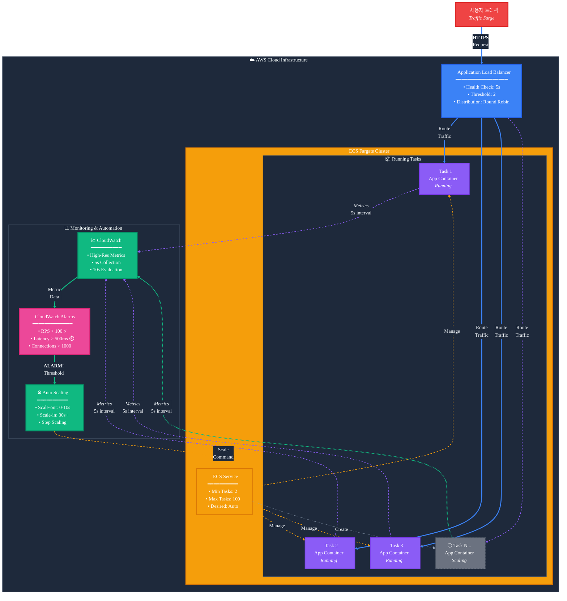

# ECS Fargate 고속 스케일링 솔루션

AWS ECS Fargate 환경에서 급증하는 트래픽에 10초 이내로 대응할 수 있는 고속 자동 스케일링 아키텍처입니다.

## 📋 목차

- [개요](#개요)
- [주요 특징](#주요-특징)
- [아키텍처](#아키텍처)
- [구현 방법](#구현-방법)
- [빠른 시작](#-빠른-시작)
- [CDK 배포](#-cdk-배포)
- [애플리케이션 배포](#-애플리케이션-배포)
- [모니터링 및 테스트](#-모니터링-및-테스트)
- [성능 최적화](#성능-최적화)
- [비용 고려사항](#비용-고려사항)
- [제한사항](#제한사항)
- [AI 활용 가이드](#-ai-활용-가이드)
- [참고 문서](#참고-문서)

## 개요

기존 ECS Fargate의 자동 스케일링은 2-3분의 지연 시간이 발생하여 갑작스러운 트래픽 증가에 효과적으로 대응하기 어렵습니다. 이 솔루션은 CloudWatch 고해상도 메트릭과 최적화된 스케일링 정책을 활용하여 **10초 이내**의 빠른 스케일링 반응 시간을 달성합니다.

## 주요 특징

### ⚡ 초고속 스케일링
- **10초 이내** 스케일링 트리거
- 5초 간격의 실시간 메트릭 수집
- 10초 주기의 CloudWatch 알람 평가

### 🎯 정확한 메트릭
- 초당 요청 수(RPS) 기반 스케일링
- 평균 응답 시간 모니터링
- 활성 연결 수 추적

### 💰 비용 효율성
- 필요한 만큼만 스케일링
- 보수적인 스케일 인 정책으로 비용 최적화
- CloudWatch API 호출 최소화

### 🛡️ 안정성
- 최소 작업 수 유지로 초기 트래픽 대응
- 스케일링 진동 방지
- 장애 대응 메커니즘 내장

## 아키텍처

### 전체 아키텍처


### 스케일링 플로우


<details>
<summary>Mermaid 다이어그램 (대체 뷰)</summary>



</details>

## 구현 방법

이 프로젝트는 AWS CDK를 사용하여 Infrastructure as Code로 구현되었습니다.

### 📁 프로젝트 구조

```
ecs-fargate-fast-scaleout/
├── 📁 cdk/                    # CDK 인프라 코드
│   ├── bin/app.ts             # CDK 애플리케이션 진입점
│   ├── lib/
│   │   ├── network-stack.ts   # VPC, ALB, 보안 그룹
│   │   ├── ecs-stack.ts       # ECS 클러스터, 서비스
│   │   ├── monitoring-stack.ts # CloudWatch 메트릭, 알람
│   │   └── autoscaling-stack.ts # 스케일링 정책
│   └── package.json
├── 📁 app/                    # 샘플 애플리케이션
│   ├── server.js              # Node.js Express 서버
│   ├── Dockerfile             # 컨테이너 이미지
│   └── package.json
└── 📁 docs/                   # 문서
    ├── architecture.md        # 아키텍처 상세 설명
    └── ideation.md           # 설계 아이디어
```

### 🏗️ 4개의 독립적인 스택

1. **NetworkStack**: VPC 및 로드밸런서
2. **EcsStack**: Fargate 클러스터 및 서비스  
3. **MonitoringStack**: CloudWatch 모니터링
4. **AutoScalingStack**: 고속 스케일링 정책

## 🚀 빠른 시작

### 전체 배포 프로세스

```bash
# 1. 저장소 클론
git clone https://github.com/serithemage/ecs-fargate-fast-scaleout.git
cd ecs-fargate-fast-scaleout

# 2. CDK 배포
cd cdk
npm install
npx cdk bootstrap
npm run deploy

# 3. 애플리케이션 이미지 빌드 및 배포
cd ../app
docker build -t fast-scaling-app .
# ECR에 푸시 후 ECS 태스크 정의 업데이트
```

## 🛠️ CDK 배포

### 1. 사전 요구사항

```bash
# AWS CLI 설치 및 구성
aws configure

# CDK 설치
npm install -g aws-cdk

# Node.js 18+ 필요
node --version
```

### 2. CDK 프로젝트 설정

```bash
cd cdk
npm install

# CDK 부트스트랩 (최초 1회)
npx cdk bootstrap
```

### 3. 스택별 배포

```bash
# 전체 스택 배포
npm run deploy

# 또는 개별 스택 배포
npx cdk deploy EcsFastScaling-Network
npx cdk deploy EcsFastScaling-Ecs  
npx cdk deploy EcsFastScaling-Monitoring
npx cdk deploy EcsFastScaling-AutoScaling
```

### 4. 배포 확인

```bash
# 스택 목록 확인
npx cdk list

# 스택 상태 확인  
npx cdk diff

# AWS 콘솔에서 확인
echo "CloudWatch 대시보드: Fast-Scaling-Monitoring"
echo "ECS 클러스터: fast-scaling-cluster"
```

## 📦 애플리케이션 배포

### 1. 컨테이너 이미지 빌드

```bash
cd app

# Docker 이미지 빌드
docker build -t fast-scaling-app .

# 로컬 테스트
docker run -p 8080:8080 fast-scaling-app
curl http://localhost:8080/health
```

### 2. ECR에 이미지 푸시

```bash
# ECR 저장소 생성
aws ecr create-repository --repository-name fast-scaling-app

# 로그인
aws ecr get-login-password --region ap-northeast-2 | \
  docker login --username AWS --password-stdin <account-id>.dkr.ecr.ap-northeast-2.amazonaws.com

# 태깅 및 푸시
docker tag fast-scaling-app:latest <account-id>.dkr.ecr.ap-northeast-2.amazonaws.com/fast-scaling-app:latest
docker push <account-id>.dkr.ecr.ap-northeast-2.amazonaws.com/fast-scaling-app:latest
```

### 3. ECS 태스크 정의 업데이트

```bash
# ECS 태스크 정의에서 nginx:alpine을 ECR 이미지로 교체
# lib/ecs-stack.ts 파일 수정 후 재배포
npx cdk deploy EcsFastScaling-Ecs
```

## 📊 모니터링 및 테스트

### 1. CloudWatch 대시보드 접근

```bash
# 대시보드 URL 확인
aws cloudformation describe-stacks \
  --stack-name EcsFastScaling-Monitoring \
  --query 'Stacks[0].Outputs[?OutputKey==`DashboardUrl`].OutputValue' \
  --output text
```

### 2. 부하 테스트

```bash
# ALB DNS 이름 확인
ALB_DNS=$(aws elbv2 describe-load-balancers \
  --names fast-scaling-alb \
  --query 'LoadBalancers[0].DNSName' \
  --output text)

# 헬스체크
curl http://$ALB_DNS/health

# 현재 메트릭 확인
curl http://$ALB_DNS/metrics

# CPU 부하 테스트 (1-10 레벨)
curl http://$ALB_DNS/load/5

# 메모리 부하 테스트 (MB 단위)
curl http://$ALB_DNS/memory/10

# 지속적인 부하 생성 (스케일링 테스트)
for i in {1..100}; do
  curl http://$ALB_DNS/load/3 &
done
```

### 3. 스케일링 이벤트 모니터링

```bash
# ECS 서비스 태스크 수 확인
aws ecs describe-services \
  --cluster fast-scaling-cluster \
  --services fast-scaling-service \
  --query 'services[0].{DesiredCount:desiredCount,RunningCount:runningCount,PendingCount:pendingCount}'

# CloudWatch 알람 상태 확인
aws cloudwatch describe-alarms \
  --alarm-names FastScaling-CustomRPS \
  --query 'MetricAlarms[0].{State:StateValue,Reason:StateReason}'

# 스케일링 활동 로그 확인
aws logs tail /ecs/fast-scaling-app --follow
```

### 4. 커스텀 메트릭 확인

```bash
# RPS 메트릭 조회
aws cloudwatch get-metric-statistics \
  --namespace FastScaling/Application \
  --metric-name RequestsPerSecond \
  --start-time $(date -u -d '1 hour ago' +%Y-%m-%dT%H:%M:%S) \
  --end-time $(date -u +%Y-%m-%dT%H:%M:%S) \
  --period 60 \
  --statistics Average

# 응답 시간 메트릭 조회  
aws cloudwatch get-metric-statistics \
  --namespace FastScaling/Application \
  --metric-name AverageResponseTime \
  --start-time $(date -u -d '1 hour ago' +%Y-%m-%dT%H:%M:%S) \
  --end-time $(date -u +%Y-%m-%dT%H:%M:%S) \
  --period 60 \
  --statistics Average
```

## 성능 최적화

### 메트릭 최적화
- ✅ 초당 요청 수 사용 (RequestCount 대신)
- ✅ 5초 간격의 고해상도 메트릭
- ✅ 실시간 큐 길이 모니터링

### 스케일링 정책 최적화
- ✅ Scale-out: 0-10초 쿨다운
- ✅ Scale-in: 30초 이상 쿨다운
- ✅ Step Scaling으로 트래픽에 따른 단계적 확장

### 사전 대응
- ✅ 최소 2개 이상의 작업 유지
- ✅ EventBridge 스케줄러로 예상 트래픽 대응
- ✅ 정기적인 부하 테스트

## 비용 고려사항

### 예상 비용 증가 요소
- CloudWatch API 호출: 약 $0.01/1,000 요청
- 고해상도 메트릭 저장: 약 $0.30/메트릭/월
- 추가 Fargate 작업 실행 비용

### 비용 최적화 방법
1. 적절한 스케일링 임계치 설정
2. 업무 시간 외 최소 작업 수 감소
3. 불필요한 메트릭 제거

## 제한사항

- **Fargate 시작 시간**: 새 컨테이너 시작까지 약 30초 소요
- **CloudWatch API 제한**: 초당 요청 수 제한 존재
- **ALB 등록 시간**: 새 타겟 등록까지 추가 시간 필요

## 🤖 AI 활용 가이드

이 프로젝트는 ChatGPT/Claude를 활용하여 설계되었습니다. 다음은 프로젝트 개발에 사용된 주요 프롬프트와 그 의도입니다.

### 1. 문제 정의 및 해결 방안 탐색(ChatGPT Deep Research)

```
ECS Fargate 환경에서 웹 애플리케이션을 운영 중인데, 갑작스러운 트래픽 증가에 대응하기 위한 
auto scaling이 작동하는데 2-3분 정도 린다. 이를 10초 이내로 단축할 수 있는 방법을 조사해줘.
```

**의도**: 
- 구체적인 문제 상황 제시 (2-3분 → 10초)
- 특정 환경 명시 (ECS Fargate)
- 명확한 목표 설정

**결과물**:
- [아이디에이션 문서](docs/ideation.md)

### 2. 아키텍처 설계 요청

```
위에서 제안한 방법을 구현한 아키텍처를 설계해주세요. 다이어그램은 mermaid 문법으로 작성해주세요.
```

**의도**:
- 구조화된 답변 유도
- 시각적 자료 요청 (다이어그램)
- 실무 적용 가능한 수준의 상세도 요구

**결과물**:
- [아키텍처 문서](docs/architecture.md)

### 3. 문서화 요청

```
리드미를 작성해줘.
```

**의도**:
- 프로젝트에 대한 구조화된 정보 전달
- 시각적 요소 포함 (이모지, 다이어그램)


### 4. 구현 코드 생성

```
이 아키텍처를 CDK로 구현해주세요.
```

**의도**:
- 구체적인 요구사항 명시
- 프로덕션 품질 코드 요청
- 실제 사용 가능한 완성도 추구

**결과물**:
- [CDK 코드](cdk/)
- [목업 앱](app/)

### 5. 문서 업데이트 요청

```
리드미를 업데이트 해줘
```

**의도**:
- 완성도 높은 문서 생성
- 구현과정에서 발생한 변경점 반영

### 프롬프트 템플릿

```
[상황 설명]
현재 {환경}에서 {문제}가 발생하고 있어.

[목표]
{구체적인 목표} 달성을 위한 방법을 조사해줘.

[제약사항]
- {제약사항 1}
- {제약사항 2}

[요청사항]
위 상황에서 {원하는 결과물}을 제안해줘.
다음 내용을 포함해줘.
1. {세부 요구사항 1}
2. {세부 요구사항 2}
```

## 📚 참고 문서

### 프로젝트 문서
- [아키텍처 상세 설명](docs/architecture.md) - 기술적 설계 및 구성 요소
- [아이디어 및 접근 방법](docs/ideation.md) - 설계 사상 및 의사결정 과정
- [CDK 구현 가이드](cdk/README.md) - 상세 배포 및 운영 가이드

### AWS 공식 문서  
- [AWS CDK 개발자 가이드](https://docs.aws.amazon.com/cdk/)
- [Amazon ECS 개발자 가이드](https://docs.aws.amazon.com/ecs/)
- [Application Auto Scaling 사용 설명서](https://docs.aws.amazon.com/autoscaling/application/userguide/)
- [CloudWatch 고해상도 메트릭](https://docs.aws.amazon.com/AmazonCloudWatch/latest/monitoring/publishingMetrics.html#high-resolution-metrics)

### 유용한 리소스
- [ECS 성능 최적화 가이드](https://aws.amazon.com/blogs/containers/deep-dive-on-amazon-ecs-cluster-auto-scaling/)
- [Fargate 비용 최적화](https://aws.amazon.com/blogs/containers/theoretical-cost-optimization-by-amazon-ecs-launch-type-fargate-vs-ec2/)
- [CloudWatch 모니터링 모범 사례](https://docs.aws.amazon.com/AmazonCloudWatch/latest/monitoring/Best_Practices_For_Alarms.html)

## 🛠️ 문제 해결

### 자주 발생하는 문제

#### 1. CDK 배포 실패
```bash
# IAM 권한 확인
aws sts get-caller-identity

# CDK 부트스트랩 상태 확인  
npx cdk bootstrap --show-template

# CloudFormation 이벤트 확인
aws cloudformation describe-stack-events --stack-name <stack-name>
```

#### 2. 스케일링이 작동하지 않음
```bash
# 알람 상태 확인
aws cloudwatch describe-alarms --alarm-names FastScaling-CustomRPS

# 메트릭 데이터 확인
aws cloudwatch get-metric-statistics \
  --namespace FastScaling/Application \
  --metric-name RequestsPerSecond \
  --start-time $(date -u -d '10 minutes ago' +%Y-%m-%dT%H:%M:%S) \
  --end-time $(date -u +%Y-%m-%dT%H:%M:%S) \
  --period 60 --statistics Average

# ECS 서비스 이벤트 확인
aws ecs describe-services \
  --cluster fast-scaling-cluster \
  --services fast-scaling-service \
  --query 'services[0].events[0:5]'
```

#### 3. 높은 비용 발생
```bash
# 현재 실행 중인 태스크 수 확인
aws ecs list-tasks --cluster fast-scaling-cluster

# 스케일링 활동 이력 확인
aws application-autoscaling describe-scaling-activities \
  --service-namespace ecs \
  --resource-id service/fast-scaling-cluster/fast-scaling-service

# CloudWatch 비용 모니터링
aws ce get-cost-and-usage \
  --time-period Start=2024-01-01,End=2024-01-31 \
  --granularity MONTHLY \
  --metrics BlendedCost \
  --group-by Type=DIMENSION,Key=SERVICE
```

### 디버깅 팁

1. **로그 확인**: `aws logs tail /ecs/fast-scaling-app --follow`
2. **메트릭 지연**: CloudWatch 메트릭은 최대 2분 지연 가능
3. **스케일링 쿨다운**: 설정된 쿨다운 시간 동안 추가 스케일링 제한
4. **IAM 권한**: ECS 태스크 역할에 CloudWatch 권한 확인

## 🤝 기여하기

1. Fork the repository
2. Create your feature branch (`git checkout -b feature/amazing-feature`)
3. Commit your changes (`git commit -m 'Add some amazing feature'`)
4. Push to the branch (`git push origin feature/amazing-feature`)  
5. Open a Pull Request

## 📄 라이선스

이 프로젝트는 MIT 라이선스 하에 배포됩니다. 자세한 내용은 [LICENSE](LICENSE) 파일을 참조하세요.

## 👥 만든 사람들

- **정영준** - *프로젝트 아이디어* - [LinkedIn](https://www.linkedin.com/in/youngjoonjeong/?locale=ko_KR)
- **정도현** - *프로젝트 구현* - [GitHub](https://github.com/serithemage)

## 🙏 Special Thanks

- OpenAI의 ChatGPT 4.5
- Anthropic의 Claude 4 Sonnet & Opus & Claude Code
