# ECS Fargate 고속 스케일링 솔루션

AWS ECS Fargate 환경에서 급증하는 트래픽에 10초 이내로 대응할 수 있는 고속 자동 스케일링 아키텍처입니다.

## 📋 목차

- [개요](#개요)
- [주요 특징](#주요-특징)
- [아키텍처](#아키텍처)
- [구현 방법](#구현-방법)
- [성능 최적화](#성능-최적화)
- [비용 고려사항](#비용-고려사항)
- [제한사항](#제한사항)
- [참고 문서](#참고-문서)

## 개요

기존 ECS Fargate의 자동 스케일링은 2-3분의 지연 시간이 발생하여 갑작스러운 트래픽 증가에 효과적으로 대응하기 어렵습니다. 이 솔루션은 CloudWatch 고해상도 메트릭과 최적화된 스케일링 정책을 활용하여 **10초 이내**의 빠른 스케일링 반응 시간을 달성합니다.

## 주요 특징

### ⚡ 초고속 스케일링
- **10초 이내** 스케일링 트리거
- 5초 간격의 실시간 메트릭 수집
- 10초 주기의 CloudWatch 알람 평가

### 🎯 정확한 메트릭
- 초당 요청 수(RPS) 기반 스케일링
- 평균 응답 시간 모니터링
- 활성 연결 수 추적

### 💰 비용 효율성
- 필요한 만큼만 스케일링
- 보수적인 스케일 인 정책으로 비용 최적화
- CloudWatch API 호출 최소화

### 🛡️ 안정성
- 최소 작업 수 유지로 초기 트래픽 대응
- 스케일링 진동 방지
- 장애 대응 메커니즘 내장

## 아키텍처

```mermaid
graph TB
    Users[사용자 트래픽]
    
    subgraph AWS Cloud
        ALB[Application Load Balancer]
        
        subgraph ECS Fargate
            Service[ECS Service]
            Task1[Task 1]
            Task2[Task 2]
            TaskN[Task N]
        end
        
        CW[CloudWatch]
        Alarms[CloudWatch Alarms]
        ASG[Auto Scaling]
    end
    
    Users -->|HTTPS| ALB
    ALB -->|트래픽 분산| Task1
    ALB -->|트래픽 분산| Task2
    ALB -->|트래픽 분산| TaskN
    
    Task1 -->|5초 간격 메트릭| CW
    Task2 -->|5초 간격 메트릭| CW
    TaskN -->|5초 간격 메트릭| CW
    
    CW --> Alarms
    Alarms -->|임계치 초과| ASG
    ASG -->|스케일링| Service
    
    Service -.-> Task1
    Service -.-> Task2
    Service -.-> TaskN
```



## 구현 방법

### 1. Application Load Balancer 설정

```yaml
HealthCheckIntervalSeconds: 5
HealthyThresholdCount: 2
UnhealthyThresholdCount: 2
HealthCheckTimeoutSeconds: 4
```

### 2. 애플리케이션 메트릭 발행

애플리케이션에서 5초마다 커스텀 메트릭을 CloudWatch로 전송:

```python
import boto3
from datetime import datetime

cloudwatch = boto3.client('cloudwatch')

def publish_metrics(request_count, response_time):
    cloudwatch.put_metric_data(
        Namespace='MyApp/Performance',
        MetricData=[
            {
                'MetricName': 'RequestsPerSecond',
                'Value': request_count / 5,
                'Unit': 'Count/Second',
                'Timestamp': datetime.utcnow(),
                'StorageResolution': 1
            },
            {
                'MetricName': 'AverageResponseTime',
                'Value': response_time,
                'Unit': 'Milliseconds',
                'Timestamp': datetime.utcnow(),
                'StorageResolution': 1
            }
        ]
    )
```

### 3. CloudWatch 알람 설정

```yaml
AlarmName: HighRequestRate
MetricName: RequestsPerSecond
Namespace: MyApp/Performance
Statistic: Average
Period: 10
EvaluationPeriods: 1
Threshold: 100
ComparisonOperator: GreaterThanThreshold
AlarmActions:
  - !Ref ScaleOutPolicy
```

### 4. Auto Scaling 정책

```yaml
ScaleOutPolicy:
  PolicyType: StepScaling
  StepScalingPolicyConfiguration:
    AdjustmentType: ChangeInCapacity
    Cooldown: 10
    StepAdjustments:
      - MetricIntervalLowerBound: 0
        MetricIntervalUpperBound: 50
        ScalingAdjustment: 1
      - MetricIntervalLowerBound: 50
        MetricIntervalUpperBound: 100
        ScalingAdjustment: 2
      - MetricIntervalLowerBound: 100
        ScalingAdjustment: 4

ScaleInPolicy:
  PolicyType: StepScaling
  StepScalingPolicyConfiguration:
    AdjustmentType: ChangeInCapacity
    Cooldown: 30
    StepAdjustments:
      - MetricIntervalUpperBound: 0
        ScalingAdjustment: -1
```

## 성능 최적화

### 메트릭 최적화
- ✅ 초당 요청 수 사용 (RequestCount 대신)
- ✅ 5초 간격의 고해상도 메트릭
- ✅ 실시간 큐 길이 모니터링

### 스케일링 정책 최적화
- ✅ Scale-out: 0-10초 쿨다운
- ✅ Scale-in: 30초 이상 쿨다운
- ✅ Step Scaling으로 트래픽에 따른 단계적 확장

### 사전 대응
- ✅ 최소 2개 이상의 작업 유지
- ✅ EventBridge 스케줄러로 예상 트래픽 대응
- ✅ 정기적인 부하 테스트

## 비용 고려사항

### 예상 비용 증가 요소
- CloudWatch API 호출: 약 $0.01/1,000 요청
- 고해상도 메트릭 저장: 약 $0.30/메트릭/월
- 추가 Fargate 작업 실행 비용

### 비용 최적화 방법
1. 적절한 스케일링 임계치 설정
2. 업무 시간 외 최소 작업 수 감소
3. 불필요한 메트릭 제거

## 제한사항

- **Fargate 시작 시간**: 새 컨테이너 시작까지 약 30초 소요
- **CloudWatch API 제한**: 초당 요청 수 제한 존재
- **ALB 등록 시간**: 새 타겟 등록까지 추가 시간 필요

## 참고 문서

- [아키텍처 상세 설명](docs/architecture.md)
- [아이디어 및 접근 방법](docs/ideation.md)
- [AWS ECS 공식 문서](https://docs.aws.amazon.com/ecs/)
- [CloudWatch 고해상도 메트릭](https://docs.aws.amazon.com/AmazonCloudWatch/latest/monitoring/publishingMetrics.html#high-resolution-metrics)

## 라이선스

이 프로젝트는 MIT 라이선스 하에 배포됩니다.