# ECS Fargate 고속 스케일링 솔루션

AWS ECS Fargate 환경에서 급증하는 트래픽에 10초 이내로 대응할 수 있는 고속 자동 스케일링 아키텍처입니다.

## 📋 목차

- [개요](#개요)
- [주요 특징](#주요-특징)
- [아키텍처](#아키텍처)
- [구현 방법](#구현-방법)
- [성능 최적화](#성능-최적화)
- [비용 고려사항](#비용-고려사항)
- [제한사항](#제한사항)
- [AI 활용 가이드](#-ai-활용-가이드)
- [참고 문서](#참고-문서)

## 개요

기존 ECS Fargate의 자동 스케일링은 2-3분의 지연 시간이 발생하여 갑작스러운 트래픽 증가에 효과적으로 대응하기 어렵습니다. 이 솔루션은 CloudWatch 고해상도 메트릭과 최적화된 스케일링 정책을 활용하여 **10초 이내**의 빠른 스케일링 반응 시간을 달성합니다.

## 주요 특징

### ⚡ 초고속 스케일링
- **10초 이내** 스케일링 트리거
- 5초 간격의 실시간 메트릭 수집
- 10초 주기의 CloudWatch 알람 평가

### 🎯 정확한 메트릭
- 초당 요청 수(RPS) 기반 스케일링
- 평균 응답 시간 모니터링
- 활성 연결 수 추적

### 💰 비용 효율성
- 필요한 만큼만 스케일링
- 보수적인 스케일 인 정책으로 비용 최적화
- CloudWatch API 호출 최소화

### 🛡️ 안정성
- 최소 작업 수 유지로 초기 트래픽 대응
- 스케일링 진동 방지
- 장애 대응 메커니즘 내장

## 아키텍처

```mermaid
%%{init: {
  'theme': 'dark',
  'themeVariables': {
    'primaryColor': '#1e293b',
    'primaryTextColor': '#f1f5f9',
    'primaryBorderColor': '#475569',
    'lineColor': '#94a3b8',
    'secondaryColor': '#475569',
    'tertiaryColor': '#334155',
    'background': '#0f172a',
    'mainBkg': '#1e293b',
    'secondBkg': '#334155',
    'tertiaryBkg': '#475569',
    'textColor': '#f1f5f9',
    'labelTextColor': '#f1f5f9',
    'errorBkgColor': '#dc2626',
    'errorTextColor': '#f1f5f9',
    'gridColor': '#334155',
    'fontFamily': 'Arial, sans-serif',
    'fontSize': '16px',
    'labelBackground': '#1e293b',
    'edgeLabelBackground': '#1e293b',
    'clusterBkg': '#1e293b',
    'clusterBorder': '#475569',
    'defaultLinkColor': '#94a3b8'
  }
}}%%

graph TB
    Users[" 👥 사용자 트래픽<br/><i>Traffic Surge</i>"]
    
    subgraph AWS[" ☁️ AWS Cloud Infrastructure "]
        ALB[" 🔄 Application Load Balancer<br/>━━━━━━━━━━━━━━━━━<br/>• Health Check: 5s<br/>• Threshold: 2<br/>• Distribution: Round Robin"]
        
        subgraph ECSCluster[" 🐳 ECS Fargate Cluster "]
            Service[" 🎯 ECS Service<br/>━━━━━━━━━━<br/>• Min Tasks: 2<br/>• Max Tasks: 100<br/>• Desired: Auto"]
            
            subgraph Tasks[" 📦 Running Tasks "]
                Task1[" 🔵 Task 1<br/>App Container<br/><i>Running</i>"]
                Task2[" 🔵 Task 2<br/>App Container<br/><i>Running</i>"]
                Task3[" 🔵 Task 3<br/>App Container<br/><i>Running</i>"]
                TaskN[" ⚪ Task N...<br/>App Container<br/><i>Scaling</i>"]
            end
        end
        
        subgraph Monitoring[" 📊 Monitoring & Automation "]
            CW[" 📈 CloudWatch<br/>━━━━━━━━━━<br/>• High-Res Metrics<br/>• 5s Collection<br/>• 10s Evaluation"]
            
            Alarms[" 🚨 CloudWatch Alarms<br/>━━━━━━━━━━━━━<br/>• RPS > 100 ⚡<br/>• Latency > 500ms ⏱️<br/>• Connections > 1000 🔌"]
            
            ASG[" ⚙️ Auto Scaling<br/>━━━━━━━━━━<br/>• Scale-out: 0-10s<br/>• Scale-in: 30s+<br/>• Step Scaling"]
        end
    end
    
    %% Traffic Flow
    Users ==>|"<b>HTTPS</b><br/>Request"| ALB
    ALB ==>|"Route<br/>Traffic"| Task1
    ALB ==>|"Route<br/>Traffic"| Task2
    ALB ==>|"Route<br/>Traffic"| Task3
    ALB -.->|"Route<br/>Traffic"| TaskN
    
    %% Metrics Flow
    Task1 -.->|"<i>Metrics</i><br/>5s interval"| CW
    Task2 -.->|"<i>Metrics</i><br/>5s interval"| CW
    Task3 -.->|"<i>Metrics</i><br/>5s interval"| CW
    TaskN -.->|"<i>Metrics</i><br/>5s interval"| CW
    
    %% Scaling Flow
    CW ==>|"Metric<br/>Data"| Alarms
    Alarms ==>|"<b>ALARM!</b><br/>Threshold"| ASG
    ASG ==>|"Scale<br/>Command"| Service
    
    %% Service Management
    Service -.->|"Manage"| Task1
    Service -.->|"Manage"| Task2
    Service -.->|"Manage"| Task3
    Service -.->|"Create"| TaskN
    
    %% Styling
    classDef userClass fill:#ef4444,stroke:#dc2626,stroke-width:3px,color:#ffffff
    classDef albClass fill:#3b82f6,stroke:#2563eb,stroke-width:3px,color:#ffffff
    classDef ecsClass fill:#f59e0b,stroke:#d97706,stroke-width:3px,color:#ffffff
    classDef monitorClass fill:#10b981,stroke:#059669,stroke-width:3px,color:#ffffff
    classDef alarmClass fill:#ec4899,stroke:#db2777,stroke-width:3px,color:#ffffff
    classDef taskClass fill:#8b5cf6,stroke:#7c3aed,stroke-width:2px,color:#ffffff
    classDef pendingClass fill:#6b7280,stroke:#4b5563,stroke-width:2px,color:#ffffff,stroke-dasharray: 5 5
    
    class Users userClass
    class ALB albClass
    class Service,ECSCluster ecsClass
    class CW,ASG monitorClass
    class Alarms alarmClass
    class Task1,Task2,Task3 taskClass
    class TaskN pendingClass
    
    %% Link Styles
    linkStyle 0,1,2,3 stroke:#3b82f6,stroke-width:3px
    linkStyle 4,5,6,7 stroke:#8b5cf6,stroke-width:2px,stroke-dasharray: 5 5
    linkStyle 8,9,10 stroke:#10b981,stroke-width:3px
    linkStyle 11,12,13,14 stroke:#f59e0b,stroke-width:2px,stroke-dasharray: 5 5
```



## 구현 방법

### 1. Application Load Balancer 설정

```yaml
HealthCheckIntervalSeconds: 5
HealthyThresholdCount: 2
UnhealthyThresholdCount: 2
HealthCheckTimeoutSeconds: 4
```

### 2. 애플리케이션 메트릭 발행

애플리케이션에서 5초마다 커스텀 메트릭을 CloudWatch로 전송:

```python
import boto3
from datetime import datetime

cloudwatch = boto3.client('cloudwatch')

def publish_metrics(request_count, response_time):
    cloudwatch.put_metric_data(
        Namespace='MyApp/Performance',
        MetricData=[
            {
                'MetricName': 'RequestsPerSecond',
                'Value': request_count / 5,
                'Unit': 'Count/Second',
                'Timestamp': datetime.utcnow(),
                'StorageResolution': 1
            },
            {
                'MetricName': 'AverageResponseTime',
                'Value': response_time,
                'Unit': 'Milliseconds',
                'Timestamp': datetime.utcnow(),
                'StorageResolution': 1
            }
        ]
    )
```

### 3. CloudWatch 알람 설정

```yaml
AlarmName: HighRequestRate
MetricName: RequestsPerSecond
Namespace: MyApp/Performance
Statistic: Average
Period: 10
EvaluationPeriods: 1
Threshold: 100
ComparisonOperator: GreaterThanThreshold
AlarmActions:
  - !Ref ScaleOutPolicy
```

### 4. Auto Scaling 정책

```yaml
ScaleOutPolicy:
  PolicyType: StepScaling
  StepScalingPolicyConfiguration:
    AdjustmentType: ChangeInCapacity
    Cooldown: 10
    StepAdjustments:
      - MetricIntervalLowerBound: 0
        MetricIntervalUpperBound: 50
        ScalingAdjustment: 1
      - MetricIntervalLowerBound: 50
        MetricIntervalUpperBound: 100
        ScalingAdjustment: 2
      - MetricIntervalLowerBound: 100
        ScalingAdjustment: 4

ScaleInPolicy:
  PolicyType: StepScaling
  StepScalingPolicyConfiguration:
    AdjustmentType: ChangeInCapacity
    Cooldown: 30
    StepAdjustments:
      - MetricIntervalUpperBound: 0
        ScalingAdjustment: -1
```

## 성능 최적화

### 메트릭 최적화
- ✅ 초당 요청 수 사용 (RequestCount 대신)
- ✅ 5초 간격의 고해상도 메트릭
- ✅ 실시간 큐 길이 모니터링

### 스케일링 정책 최적화
- ✅ Scale-out: 0-10초 쿨다운
- ✅ Scale-in: 30초 이상 쿨다운
- ✅ Step Scaling으로 트래픽에 따른 단계적 확장

### 사전 대응
- ✅ 최소 2개 이상의 작업 유지
- ✅ EventBridge 스케줄러로 예상 트래픽 대응
- ✅ 정기적인 부하 테스트

## 비용 고려사항

### 예상 비용 증가 요소
- CloudWatch API 호출: 약 $0.01/1,000 요청
- 고해상도 메트릭 저장: 약 $0.30/메트릭/월
- 추가 Fargate 작업 실행 비용

### 비용 최적화 방법
1. 적절한 스케일링 임계치 설정
2. 업무 시간 외 최소 작업 수 감소
3. 불필요한 메트릭 제거

## 제한사항

- **Fargate 시작 시간**: 새 컨테이너 시작까지 약 30초 소요
- **CloudWatch API 제한**: 초당 요청 수 제한 존재
- **ALB 등록 시간**: 새 타겟 등록까지 추가 시간 필요

## 🤖 AI 활용 가이드

이 프로젝트는 ChatGPT/Claude를 활용하여 설계되었습니다. 다음은 프로젝트 개발에 사용된 주요 프롬프트와 그 의도입니다.

### 1. 문제 정의 및 해결 방안 탐색

```
ECS Fargate 환경에서 웹 애플리케이션을 운영 중인데, 갑작스러운 트래픽 증가에 대응하기 위한 
auto scaling이 작동하는데 2-3분 정도 걸립니다. 이를 10초 이내로 단축할 수 있는 방법을 알려주세요.
```

**의도**: 
- 구체적인 문제 상황 제시 (2-3분 → 10초)
- 특정 환경 명시 (ECS Fargate)
- 명확한 목표 설정

### 2. 아키텍처 설계 요청

```
위에서 제안한 CloudWatch 고해상도 메트릭을 활용한 방법에 대해 구체적인 아키텍처를 설계해주세요. 
다음 내용을 포함해주세요:
1. 전체 아키텍처 다이어그램
2. 각 컴포넌트의 역할과 설정
3. 데이터 흐름
4. 구현 시 주의사항
```

**의도**:
- 구조화된 답변 유도
- 시각적 자료 요청 (다이어그램)
- 실무 적용 가능한 수준의 상세도 요구

### 3. 구현 코드 생성

```
위 아키텍처에서 애플리케이션이 CloudWatch에 커스텀 메트릭을 발행하는 Python 코드를 작성해주세요.
다음 요구사항을 만족해야 합니다:
- 5초마다 메트릭 발행
- 초당 요청 수, 평균 응답 시간 포함
- 에러 처리 및 재시도 로직
- 프로덕션 환경에서 사용 가능한 수준
```

**의도**:
- 구체적인 요구사항 명시
- 프로덕션 품질 코드 요청
- 실제 사용 가능한 완성도 추구

### 4. 문서화 요청

```
이 프로젝트의 README.md를 작성해주세요. 다음 섹션을 포함해야 합니다:
- 프로젝트 개요와 해결하는 문제
- 주요 특징 (이모지 활용)
- 아키텍처 (mermaid 다이어그램)
- 구현 방법 (단계별 가이드)
- 성능 최적화 팁
- 비용 고려사항
- 제한사항
```

**의도**:
- 완성도 높은 문서 생성
- 구조화된 정보 전달
- 시각적 요소 포함 (이모지, 다이어그램)

### 5. 최적화 및 개선

```
현재 설계한 아키텍처에서 추가로 최적화할 수 있는 부분이나 
고려해야 할 엣지 케이스가 있다면 알려주세요.
특히 비용 효율성과 안정성 측면에서 검토해주세요.
```

**의도**:
- 비판적 검토 요청
- 실무 고려사항 확인
- 지속적 개선 방안 모색

### AI 활용 팁

1. **구체적인 컨텍스트 제공**: 환경, 제약사항, 목표를 명확히 제시
2. **단계적 접근**: 큰 문제를 작은 단위로 나누어 질문
3. **검증 요청**: 생성된 솔루션의 장단점과 대안 요구
4. **반복적 개선**: 첫 답변을 기반으로 추가 질문과 개선 요청

### 프롬프트 템플릿

```
[상황 설명]
현재 {환경}에서 {문제}가 발생하고 있습니다.

[목표]
{구체적인 목표}를 달성하고 싶습니다.

[제약사항]
- {제약사항 1}
- {제약사항 2}

[요청사항]
위 상황에서 {원하는 결과물}을 만들어주세요.
다음 내용을 포함해주세요:
1. {세부 요구사항 1}
2. {세부 요구사항 2}
```

## 참고 문서

- [아키텍처 상세 설명](docs/architecture.md)
- [아이디어 및 접근 방법](docs/ideation.md)
- [AWS ECS 공식 문서](https://docs.aws.amazon.com/ecs/)
- [CloudWatch 고해상도 메트릭](https://docs.aws.amazon.com/AmazonCloudWatch/latest/monitoring/publishingMetrics.html#high-resolution-metrics)

## 라이선스

이 프로젝트는 MIT 라이선스 하에 배포됩니다.