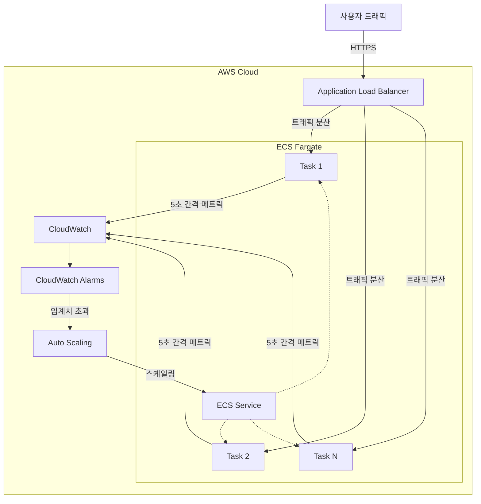

# ECS Fargate 고속 스케일링 아키텍처

## 개요

본 문서는 ECS Fargate 환경에서 웹 애플리케이션의 급증하는 트래픽에 대응하기 위한 고속 스케일링 아키텍처를 설명합니다. 이 아키텍처는 기존의 2-3분 지연을 10초 이내로 단축하여 트래픽 급증에 효과적으로 대응할 수 있습니다.

## 아키텍처 다이어그램

## 주요 컴포넌트

### 1. Application Load Balancer (ALB)
- 5초 간격의 헬스체크 설정
- Healthy Threshold: 2회 (최대 10초 이내)
- 트래픽 분산 및 상태 모니터링

### 2. ECS Fargate
- 컨테이너 기반 애플리케이션 실행
- Auto Scaling 대상
- 최소 작업 수 유지로 초기 트래픽 대응

### 3. CloudWatch
- 고해상도(HR) 커스텀 메트릭 수집
- 5초 간격의 메트릭 발행
- 10초 주기 알람 설정

### 4. Application
- 초당 요청 수 등 실시간 메트릭 수집
- CloudWatch API를 통한 메트릭 발행
- 성능 모니터링 및 로깅

### 5. Auto Scaling
- CloudWatch 알람 기반 스케일링 정책
- Scale-out Cooldown: 0-10초
- Scale-in Cooldown: 30초 이상

## 스케일링 프로세스

1. 애플리케이션이 5초 간격으로 실시간 메트릭을 CloudWatch에 발행
2. CloudWatch가 10초 주기로 알람 평가
3. 임계치 초과 시 Auto Scaling 정책 트리거
4. ECS Fargate 서비스 스케일링 실행
5. ALB가 새로운 컨테이너를 트래픽 분산 대상으로 등록

## 최적화 포인트

1. **메트릭 최적화**
   - RequestCount 대신 초당 요청 수 사용
   - 평균 응답 시간 모니터링
   - 큐 길이 등 실시간 지표 활용

2. **스케일링 정책**
   - Scale-out은 즉시 실행 (0-10초 쿨다운)
   - Scale-in은 보수적 접근 (30초 이상 쿨다운)
   - 진동 방지를 위한 적절한 임계치 설정

3. **사전 대응**
   - 예상 트래픽에 대한 EventBridge 스케줄러 활용
   - 최소 작업 수 유지로 초기 트래픽 대응
   - 정기적인 부하 테스트로 시스템 검증

## 운영 고려사항

1. **비용 최적화**
   - CloudWatch API 호출 비용 모니터링
   - 적절한 스케일링 임계치 설정으로 불필요한 스케일링 방지

2. **모니터링**
   - CloudWatch 대시보드를 통한 실시간 모니터링
   - 스케일링 이벤트 로깅 및 분석
   - 성능 메트릭 추적

3. **장애 대응**
   - 스케일링 실패 시 알림 설정
   - 수동 스케일링 절차 문서화
   - 정기적인 장애 대응 훈련

## 제한사항

1. ECS Fargate 컨테이너 시작 시간 (약 30초)
2. CloudWatch API 호출 제한
3. 비용 증가 가능성

## 결론

본 아키텍처는 AWS 네이티브 서비스를 활용하여 구현이 간단하고 신뢰성이 높은 고속 스케일링 솔루션을 제공합니다. 10초 이내의 스케일링 반응 시간을 달성하면서도, 운영 복잡성과 비용을 최소화할 수 있습니다. 