# ECS Fargate 고속 스케일링 아키텍처

## 개요

본 문서는 ECS Fargate 환경에서 웹 애플리케이션의 급증하는 트래픽에 대응하기 위한 고속 스케일링 아키텍처를 설명합니다. 이 아키텍처는 기존의 2-3분 지연을 10초 이내로 단축하여 트래픽 급증에 효과적으로 대응할 수 있습니다.

## 아키텍처 다이어그램

### 전체 아키텍처

### 스케일링 프로세스 흐름

### Mermaid 다이어그램 (대체 뷰)

```mermaid
%%{init: {
  'theme': 'dark',
  'themeVariables': {
    'primaryColor': '#1e293b',
    'primaryTextColor': '#f1f5f9',
    'primaryBorderColor': '#475569',
    'lineColor': '#94a3b8',
    'secondaryColor': '#475569',
    'tertiaryColor': '#334155',
    'background': '#0f172a',
    'mainBkg': '#1e293b',
    'secondBkg': '#334155',
    'tertiaryBkg': '#475569',
    'textColor': '#f1f5f9',
    'labelTextColor': '#f1f5f9',
    'errorBkgColor': '#dc2626',
    'errorTextColor': '#f1f5f9',
    'gridColor': '#334155',
    'fontFamily': 'Arial, sans-serif',
    'fontSize': '16px',
    'labelBackground': '#1e293b',
    'edgeLabelBackground': '#1e293b',
    'clusterBkg': '#1e293b',
    'clusterBorder': '#475569',
    'defaultLinkColor': '#94a3b8'
  }
}}%%

graph TB
    Users[" 👥 사용자 트래픽<br/><i>Traffic Surge</i>"]
    
    subgraph AWS[" ☁️ AWS Cloud Infrastructure "]
        ALB[" 🔄 Application Load Balancer<br/>━━━━━━━━━━━━━━━━━<br/>• Health Check: 5s<br/>• Threshold: 2<br/>• Distribution: Round Robin"]
        
        subgraph ECSCluster[" 🐳 ECS Fargate Cluster "]
            Service[" 🎯 ECS Service<br/>━━━━━━━━━━<br/>• Min Tasks: 2<br/>• Max Tasks: 100<br/>• Desired: Auto"]
            
            subgraph Tasks[" 📦 Running Tasks "]
                Task1[" 🔵 Task 1<br/>App Container<br/><i>Running</i>"]
                Task2[" 🔵 Task 2<br/>App Container<br/><i>Running</i>"]
                Task3[" 🔵 Task 3<br/>App Container<br/><i>Running</i>"]
                TaskN[" ⚪ Task N...<br/>App Container<br/><i>Scaling</i>"]
            end
        end
        
        subgraph Monitoring[" 📊 Monitoring & Automation "]
            CW[" 📈 CloudWatch<br/>━━━━━━━━━━<br/>• High-Res Metrics<br/>• 5s Collection<br/>• 10s Evaluation"]
            
            Alarms[" 🚨 CloudWatch Alarms<br/>━━━━━━━━━━━━━<br/>• RPS > 100 ⚡<br/>• Latency > 500ms ⏱️<br/>• Connections > 1000 🔌"]
            
            ASG[" ⚙️ Auto Scaling<br/>━━━━━━━━━━<br/>• Scale-out: 0-10s<br/>• Scale-in: 30s+<br/>• Step Scaling"]
        end
    end
    
    %% Traffic Flow
    Users ==>|"<b>HTTPS</b><br/>Request"| ALB
    ALB ==>|"Route<br/>Traffic"| Task1
    ALB ==>|"Route<br/>Traffic"| Task2
    ALB ==>|"Route<br/>Traffic"| Task3
    ALB -.->|"Route<br/>Traffic"| TaskN
    
    %% Metrics Flow
    Task1 -.->|"<i>Metrics</i><br/>5s interval"| CW
    Task2 -.->|"<i>Metrics</i><br/>5s interval"| CW
    Task3 -.->|"<i>Metrics</i><br/>5s interval"| CW
    TaskN -.->|"<i>Metrics</i><br/>5s interval"| CW
    
    %% Scaling Flow
    CW ==>|"Metric<br/>Data"| Alarms
    Alarms ==>|"<b>ALARM!</b><br/>Threshold"| ASG
    ASG ==>|"Scale<br/>Command"| Service
    
    %% Service Management
    Service -.->|"Manage"| Task1
    Service -.->|"Manage"| Task2
    Service -.->|"Manage"| Task3
    Service -.->|"Create"| TaskN
    
    %% Styling
    classDef userClass fill:#ef4444,stroke:#dc2626,stroke-width:3px,color:#ffffff
    classDef albClass fill:#3b82f6,stroke:#2563eb,stroke-width:3px,color:#ffffff
    classDef ecsClass fill:#f59e0b,stroke:#d97706,stroke-width:3px,color:#ffffff
    classDef monitorClass fill:#10b981,stroke:#059669,stroke-width:3px,color:#ffffff
    classDef alarmClass fill:#ec4899,stroke:#db2777,stroke-width:3px,color:#ffffff
    classDef taskClass fill:#8b5cf6,stroke:#7c3aed,stroke-width:2px,color:#ffffff
    classDef pendingClass fill:#6b7280,stroke:#4b5563,stroke-width:2px,color:#ffffff,stroke-dasharray: 5 5
    
    class Users userClass
    class ALB albClass
    class Service,ECSCluster ecsClass
    class CW,ASG monitorClass
    class Alarms alarmClass
    class Task1,Task2,Task3 taskClass
    class TaskN pendingClass
    
    %% Link Styles
    linkStyle 0,1,2,3 stroke:#3b82f6,stroke-width:3px
    linkStyle 4,5,6,7 stroke:#8b5cf6,stroke-width:2px,stroke-dasharray: 5 5
    linkStyle 8,9,10 stroke:#10b981,stroke-width:3px
    linkStyle 11,12,13,14 stroke:#f59e0b,stroke-width:2px,stroke-dasharray: 5 5
```

Mermaid로 보기

## 주요 컴포넌트

### 1. Application Load Balancer (ALB)
- 5초 간격의 헬스체크 설정
- Healthy Threshold: 2회 (최대 10초 이내)
- 트래픽 분산 및 상태 모니터링

### 2. ECS Fargate
- 컨테이너 기반 애플리케이션 실행
- Auto Scaling 대상
- 최소 작업 수 유지로 초기 트래픽 대응

### 3. CloudWatch
- 고해상도(HR) 커스텀 메트릭 수집
- 5초 간격의 메트릭 발행
- 10초 주기 알람 설정

### 4. Application
- 초당 요청 수 등 실시간 메트릭 수집
- CloudWatch API를 통한 메트릭 발행
- 성능 모니터링 및 로깅

### 5. Auto Scaling
- CloudWatch 알람 기반 스케일링 정책
- Scale-out Cooldown: 0-10초
- Scale-in Cooldown: 30초 이상

## 스케일링 프로세스

1. 애플리케이션이 5초 간격으로 실시간 메트릭을 CloudWatch에 발행
2. CloudWatch가 10초 주기로 알람 평가
3. 임계치 초과 시 Auto Scaling 정책 트리거
4. ECS Fargate 서비스 스케일링 실행
5. ALB가 새로운 컨테이너를 트래픽 분산 대상으로 등록

## 최적화 포인트

1. **메트릭 최적화**
   - RequestCount 대신 초당 요청 수 사용
   - 평균 응답 시간 모니터링
   - 큐 길이 등 실시간 지표 활용

2. **스케일링 정책**
   - Scale-out은 즉시 실행 (0-10초 쿨다운)
   - Scale-in은 보수적 접근 (30초 이상 쿨다운)
   - 진동 방지를 위한 적절한 임계치 설정

3. **사전 대응**
   - 예상 트래픽에 대한 EventBridge 스케줄러 활용
   - 최소 작업 수 유지로 초기 트래픽 대응
   - 정기적인 부하 테스트로 시스템 검증

## 운영 고려사항

1. **비용 최적화**
   - CloudWatch API 호출 비용 모니터링
   - 적절한 스케일링 임계치 설정으로 불필요한 스케일링 방지

2. **모니터링**
   - CloudWatch 대시보드를 통한 실시간 모니터링
   - 스케일링 이벤트 로깅 및 분석
   - 성능 메트릭 추적

3. **장애 대응**
   - 스케일링 실패 시 알림 설정
   - 수동 스케일링 절차 문서화
   - 정기적인 장애 대응 훈련

## 제한사항

1. ECS Fargate 컨테이너 시작 시간 (약 30초)
2. CloudWatch API 호출 제한
3. 비용 증가 가능성

## 결론

본 아키텍처는 AWS 네이티브 서비스를 활용하여 구현이 간단하고 신뢰성이 높은 고속 스케일링 솔루션을 제공합니다. 10초 이내의 스케일링 반응 시간을 달성하면서도, 운영 복잡성과 비용을 최소화할 수 있습니다. 